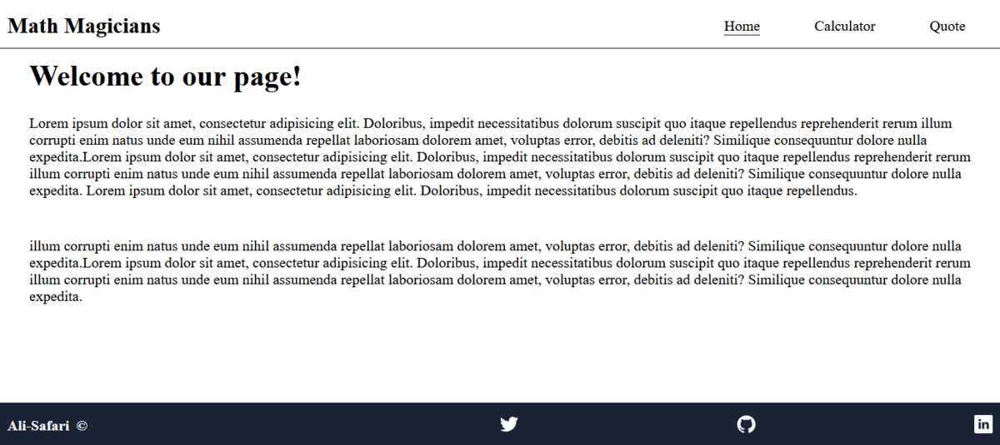

<a name="readme-top"></a>

<div align="center">

  [](https://www.microverse.org/?grsf=04r25h)
  <br/>

  <h3><b>Math Magician Project</b></h3>
</div>

<!-- TABLE OF CONTENTS -->

# 📗 Table of Contents

- [📖 About the Project](#about-project)
  - [🛠 Built With](#built-with)
    - [Tech Stack](#tech-stack)
    - [Key Features](#key-features)
  - [🚀 Live Demo](#live-demo)
- [💻 Getting Started](#getting-started)
  - [Setup](#setup)
  - [Prerequisites](#prerequisites)
  - [Install](#install)
  - [Usage](#usage)
  - [Run tests](#run-tests)
  - [Deployment](#deployment)
- [👥 Authors](#authors)
- [🔭 Future Features](#future-features)
- [🤝 Contributing](#contributing)
- [⭐️ Show your support](#support)
- [🙏 Acknowledgements](#acknowledgements)
- [❓ FAQ (OPTIONAL)](#faq)
- [📝 License](#license)

<!-- PROJECT DESCRIPTION -->

# 📖 [Math Magician] <a name="about-project"></a>


**[Math Magician]** is a SPA (Single Page Application). It will help you to solve some basic calculation on Math, find some interesting quotes and give you some information about itself.

## 🛠 Built With <a name="built-with"></a>
- Javascript
- React
- JSX
- CSS
### Tech Stack <a name="tech-stack"></a>
- API
- Microverse codes for backend of calculator

> This application will get data from API and will show it while
users click on Quote section.

> Microverse codes will do all calculations for calculator

<details>
  <summary>Client</summary>
  <ul>
    <li><a href="https://reactjs.org/">React.js</a></li>
  </ul>
</details>

<details>
  <summary>Server</summary>
  <ul>
    <li>NA</li>
  </ul>
</details>

<details>
<summary>Database</summary>
  <ul>
    <li>NA</li>
  </ul>
</details>

<!-- Features -->

### Key Features <a name="key-features"></a>


- **[Introduction]**
- **[Calculation]**
- **[Presenting some quotes]**

<p align="right">(<a href="#readme-top">back to top</a>)</p>

<!-- LIVE DEMO -->

## 🚀 Live Demo <a name="live-demo"></a>

> Add a link to your deployed project.

- [Click](https://deploy-preview-8--wondrous-tapioca-e22d72.netlify.app/)

<p align="right">(<a href="#readme-top">back to top</a>)</p>

<!-- GETTING STARTED -->

## 💻 Getting Started <a name="getting-started"></a>

## Setup
- Clone this project
```
- $ git clone https://github.com/Ali-0111/Math-Magicians.git
- $ cd Math_Magicians
```
- Install npm packages
```
$ npm install
```
- Install dependencies
```
$ npm install big.js
```

```
$ npm install prop-types
```

### Usage

- Open on live server

```
- $ npm run start
```

### Prerequisites

In order to run this project you need:

- Browser
- Visual Studio
- Install dependencies


### Run tests

To run tests, run the following command:

```
- $ npm run test
```

### Deployment

You can deploy this project using:
```
- Netlify (Free service for deployment)
```

<p align="right">(<a href="#readme-top">back to top</a>)</p>

<!-- AUTHORS -->
## Author:

👤 **Qurban Ali Safari**
- GitHub: [@Ali-0111](https://github.com/Ali-0111)
- Twitter: [@qurban_safari](https://twitter.com/qurban_safari)
- LinkedIn: [@ali](https://www.linkedin.com/in/ali-safari-695214202/)
> Mention all of the collaborators of this project.

<!-- 👤 **Author1**

- GitHub: [@githubhandle](https://github.com/githubhandle)
- Twitter: [@twitterhandle](https://twitter.com/twitterhandle)
- LinkedIn: [LinkedIn](https://linkedin.com/in/linkedinhandle)

👤 **Author2**

- GitHub: [@githubhandle](https://github.com/githubhandle)
- Twitter: [@twitterhandle](https://twitter.com/twitterhandle)
- LinkedIn: [LinkedIn](https://linkedin.com/in/linkedinhandle)
 -->
<p align="right">(<a href="#readme-top">back to top</a>)</p>

<!-- FUTURE FEATURES -->

## 🔭 Future Features <a name="future-features"></a>


- [ ] **[Add more functionality for calculating]**
- [ ] **[Add a good UI using Bootrstrap]**
- [ ] **[Deploy the project]**

<p align="right">(<a href="#readme-top">back to top</a>)</p>

<!-- CONTRIBUTING -->

## 🤝 Contributing <a name="contributing"></a>

Contributions, issues, and feature requests are welcome!

Feel free to check the [issues page](../../issues/).

<!-- SUPPORT -->

## ⭐️ Show your support <a name="support"></a>

Give a ⭐️ if you like this project!

<p align="right">(<a href="#readme-top">back to top</a>)</p>

<!-- ACKNOWLEDGEMENTS -->

## 🙏 Acknowledgments <a name="acknowledgements"></a>

I would like to thank Microverse for helping to build this project.
It is an educational project. 

<p align="right">(<a href="#readme-top">back to top</a>)</p>

<!-- FAQ (optional) -->

<!-- LICENSE -->

## 📝 License <a name="license"></a>

This project is [MIT](./LICENSE) licensed.
<p align="right">(<a href="#readme-top">back to top</a>)</p>
